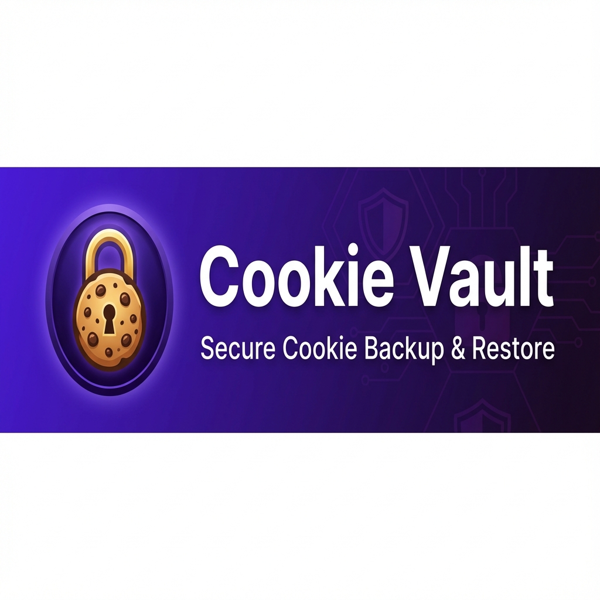

<div align="center">



# Cookie Vault

**Secure backup and restoration of your browser cookies for seamless migrations.**

[](LICENSE)
[](https://github.com/Zendevve/cookie-vault)
[](package.json)
[]()

[Features](#-features) • [Background](#-background-story) • [Getting Started](#-getting-started) • [Development](#-development) • [Roadmap](#-roadmap)

</div>

---

## ✨ Features

**Cookie Vault** is a local-first Chrome extension designed for privacy-conscious users who need to migrate browser sessions between devices or browsers without re-authenticating.

- **🔒 Military-Grade Encryption**: Uses AES-256-GCM via the Web Crypto API. Your password never leaves your device.
- **📂 Universal Formats**:
  - Backup to encrypted `.cv` files.
  - Export to Netscape HTTP Cookie File format (compatible with `wget`, `curl`, `yt-dlp`).
  - Export to JSON for JDownloader.
- **🛡️ Zero Standing Privileges**: Runs with minimal permissions (`activeTab`) and only requests broad access when you explicitly initiate a backup.
- **🍪 Legacy Support**: Fully compatible with `.ckz` files from older cookie backup extensions.
- **✈️ Offline Ready**: Fully functional without an internet connection.

---

## 📖 Background Story

Migrating to a new computer or switching browsers is often a painful process of logging into dozens of websites again. Existing tools were either outdated, closed-source, or required sending data to a cloud server.

**Cookie Vault** was built to solve this problem with a "Security First" philosophy. We believe your session data is sensitive and should never leave your control. By implementing **Zero Standing Privileges** and **Local-First Architecture**, we ensure that even if the extension were compromised, your data remains safe.

---

## 🚀 Getting Started

### Prerequisites

- Node.js 18+
- npm 9+

### Installation

1. **Clone the repository**
   ```bash
   git clone https://github.com/Zendevve/cookie-vault.git
   cd cookie-vault
   ```

2. **Install dependencies**
   ```bash
   npm install
   ```

3. **Build the extension**
   ```bash
   npm run build
   ```

4. **Load in Chrome/Edge/Brave**
   - Open `chrome://extensions`
   - Enable **Developer mode**
   - Click **Load unpacked**
   - Select the `dist/` folder

---

## 📂 What's Inside?

```
cookie-vault/
├── src/
│   ├── components/       # React UI components
│   ├── hooks/           # Custom React hooks
│   ├── lib/             # Core logic (crypto, cookies)
│   ├── assets/          # Static assets
│   ├── App.tsx          # Main entry point
│   └── manifest.json    # Extension manifest
├── docs/                # Documentation & Assets
├── .github/             # GitHub templates & workflows
└── dist/                # Production build artifacts
```

---

## ⚙️ Configuration

Cookie Vault works out of the box, but you can customize the build process:

| Environment Variable | Description |
| -------------------- | ----------- |
| `VITE_APP_VERSION`   | Override the version number displayed in the UI |

---

## 🧪 Testing

We use **Vitest** for unit and integration testing.

```bash
# Run all tests
npm run test

# Run with coverage report
npm run test:coverage
```

Our test suite covers:
- ✅ Crypto round-trip (Encryption/Decryption)
- ✅ Partitioned cookie handling (CHIPS)
- ✅ Legacy format imports
- ✅ Password validation logic

---

## 🗺️ Roadmap

We follow a structured roadmap located in [docs/ROADMAP.md](docs/ROADMAP.md).

- [x] **v1.0.0**: Initial Release (AES-256 Encryption)
- [x] **v1.1.0**: Netscape & JDownloader Exports (Current)
- [ ] **v1.2.0**: Firefox Support (Gecko)
- [ ] **v1.3.0**: Encrypted Cloud Sync (Optional)

---

## 🤝 Contributing

Contributions are welcome! Please read our [Contributing Guidelines](.github/CONTRIBUTING.md) and [Code of Conduct](.github/CODE_OF_CONDUCT.md).

1. Fork the project
2. Create your feature branch (`git checkout -b feature/AmazingFeature`)
3. Commit your changes (`git commit -m 'Add some AmazingFeature'`)
4. Push to the branch (`git push origin feature/AmazingFeature`)
5. Open a Pull Request

---

## 🛡️ Security

For security vulnerabilities, please refer to our [Security Policy](.github/SECURITY.md).

---

## 📄 License

Distributed under the **GNU GPLv3** License. See [LICENSE](LICENSE) for more information.

---

## 👏 Credits

See [CREDITS.md](.github/CREDITS.md) for the full list of contributors and acknowledgement of open-source libraries used in this project.

---

<div align="center">

[](https://github.com/Zendevve/cookie-vault)

**Made with ❤️ by Zendevve**

</div>
